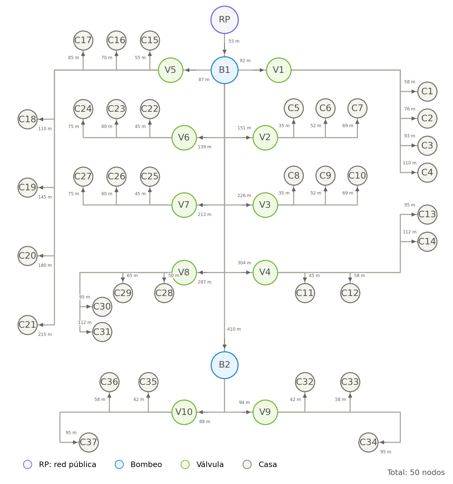
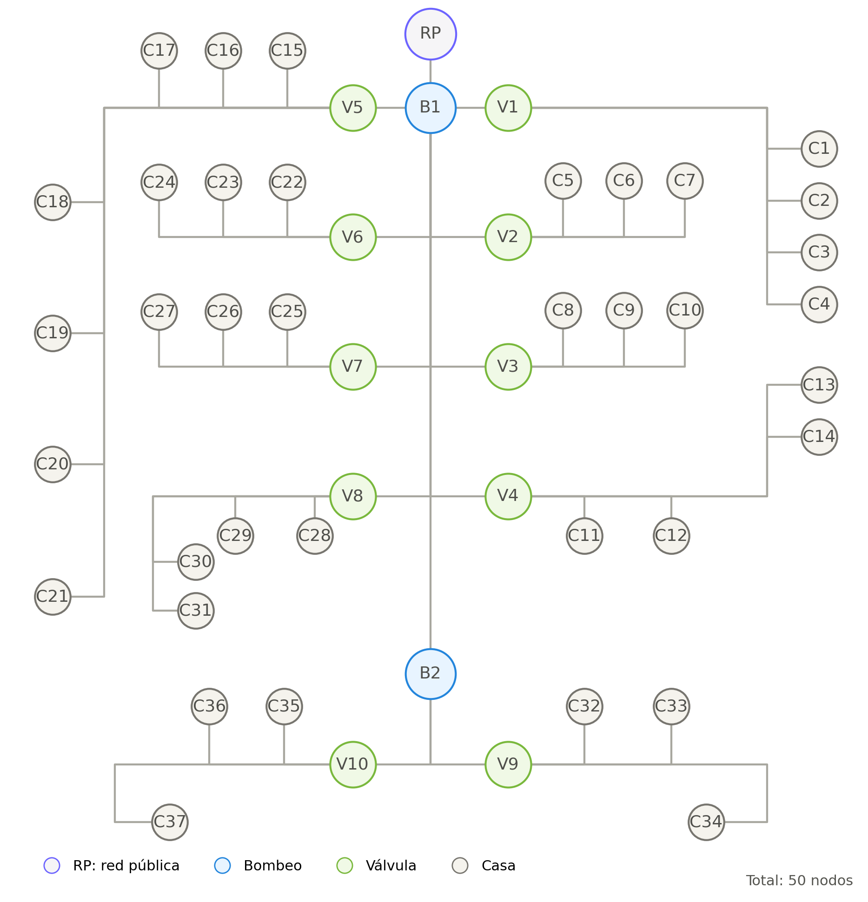

# Red de Distribución de Agua - Ciudad Celeste, Etapa La Coralia

> **Proyecto del Grupo 6** desarrollado para la asignatura **Análisis de Algoritmos** de la **Universidad Espíritu Santo (UEES)**.

---

# Referencia del Entorno

El modelo desarrollado en este proyecto toma como referencia la distribución general de la urbanización **Ciudad Celeste – Etapa La Coralia**, ubicada en el cantón Samborondón, provincia del Guayas, Ecuador.

La imagen satelital se utilizó únicamente para identificar la organización espacial de la urbanización, la distribución de las manzanas y la ubicación aproximada de las viviendas. **No corresponde al plano hidráulico oficial** ni representa la infraestructura real de abastecimiento de agua potable.

<p align="center">

</p>

<p align="center">
<b>Figura 1.</b> Vista satelital de la urbanización Ciudad Celeste – Etapa La Coralia utilizada como referencia para el diseño del modelo académico.
</p>

> **Importante**
>
> Este proyecto implementa un **modelo topológico y académico** basado en teoría de grafos. Su finalidad es representar la conectividad de una red de distribución de agua mediante estructuras computacionales. No pretende reproducir la infraestructura hidráulica real de la urbanización ni realizar simulaciones de presión, caudal, velocidad del agua o pérdidas de energía.

---

# Descripción del Proyecto

La aplicación desarrolla un modelo computacional de una red de distribución de agua potable utilizando **teoría de grafos** y el lenguaje de programación **Python**.

El sistema genera automáticamente un conjunto de datos en formato CSV, construye un **grafo dirigido y ponderado** mediante la biblioteca **NetworkX**, ejecuta un conjunto de validaciones sobre la estructura del modelo y genera una representación gráfica de toda la red.

La infraestructura modelada está compuesta por:

- 1 conexión con la red pública (**RP**).
- 2 estaciones de bombeo (**B1** y **B2**).
- 10 válvulas de sectorización (**V1 – V10**).
- 37 viviendas (**C1 – C37**).

Cada tubería almacena información técnica como longitud, material, diámetro, presión de trabajo, profundidad de instalación y demanda estimada aguas abajo. Estos atributos permiten representar la red de manera más cercana a un sistema real y preparan el modelo para futuras aplicaciones de algoritmos de grafos.

---

# Tecnologías Utilizadas

La aplicación fue desarrollada utilizando Python y un conjunto de bibliotecas orientadas al análisis de datos, construcción de grafos y visualización de información.

| Tecnología | Función dentro del proyecto |
|------------|-----------------------------|
| **Python 3** | Lenguaje principal utilizado para el desarrollo de la aplicación. |
| **Pandas** | Generación y manipulación de los archivos `nodos.csv` y `tuberias.csv`. |
| **NetworkX** | Construcción y manipulación del grafo dirigido y ponderado. |
| **Matplotlib** | Visualización gráfica de la red de distribución de agua. |
| **Pathlib** | Administración de rutas y organización de archivos del proyecto. |
| **CSV** | Almacenamiento estructurado del dataset generado automáticamente. |

---

# Ficha Técnica del Modelo

| Característica | Valor |
|----------------|------:|
| Tipo de grafo | Dirigido y ponderado |
| Nodos | 50 |
| Aristas | 49 |
| Red Pública | 1 |
| Estaciones de Bombeo | 2 |
| Válvulas | 10 |
| Viviendas | 37 |
| Peso de las aristas | Longitud de la tubería (m) |
| Urbanización de referencia | Ciudad Celeste – Etapa La Coralia |
| Biblioteca de grafos | NetworkX |

---

# Arquitectura General del Proyecto

La aplicación fue diseñada siguiendo una arquitectura modular, donde cada archivo Python cumple una función específica dentro del proceso de generación y análisis de la red.

Esta organización permite separar la lógica de configuración, la generación del dataset, la construcción del grafo, las validaciones y la visualización, facilitando el mantenimiento del código y futuras ampliaciones del proyecto.

```text
                 Configuración de la Red
                           │
                           ▼
               configuracion_red.py
                           │
                           ▼
                generar_dataset.py
                           │
                           ▼
        nodos.csv      tuberias.csv
                 │             │
                 └──────┬──────┘
                        ▼
                crear_grafo.py
                        │
                        ▼
         Grafo Dirigido y Ponderado
                        │
                        ▼
              validar_grafo.py
                        │
                        ▼
           visualizar_grafo.py
                        │
                        ▼
      grafo_red_agua_coralia.png
```

Cada etapa depende únicamente de la información generada por el módulo anterior, logrando un flujo ordenado, reutilizable y fácil de mantener.

---

# Estructura del Proyecto

```text
aalg_act2_2p_ord1_26_grupo6/
│
├── proyecto/
│   │
│   ├── configuracion_red.py      # Configuración de la red
│   ├── generar_dataset.py        # Generación automática del dataset
│   ├── crear_grafo.py            # Construcción del grafo dirigido y ponderado
│   ├── validar_grafo.py          # Validaciones del modelo
│   ├── visualizar_grafo.py       # Generación de la imagen del grafo
│
├── dataset/
│   │
│   ├── nodos.csv
│   └── tuberias.csv
│
├── Capturas/
│   │
│   ├── Ciudadela-Ciudad Celeste.jpg
│   ├── grafo_red_agua_coralia_Dirigido.png
│   └── grafo_red_agua_coralia_Dirigido_Ponderado.png
│
├── main.py
├── requirements.txt
├── .gitignore
└── README.md
```

---

# Flujo de Ejecución

La aplicación ejecuta automáticamente todas las etapas necesarias para construir el modelo de la red.

1. Configuración de la red.
2. Generación automática del dataset.
3. Construcción del grafo dirigido y ponderado.
4. Validación del modelo.
5. Generación de la representación gráfica.

Todo el proceso puede ejecutarse mediante un único comando.

```bash
python main.py
```

---

# Componentes de la Red

El modelo representa los principales elementos de una red de distribución de agua potable mediante nodos y aristas.

| Componente | Cantidad | Descripción |
|------------|---------:|-------------|
| Red Pública | 1 | Punto de ingreso del agua hacia la urbanización. |
| Estaciones de Bombeo | 2 | Distribuyen el agua hacia los diferentes sectores. |
| Válvulas de Sectorización | 10 | Dividen la red en sectores independientes de abastecimiento. |
| Viviendas | 37 | Representan los puntos finales de consumo. |
| Tuberías | 49 | Conectan todos los componentes de la red. |

---

# Modelo del Grafo

La red fue representada mediante un **grafo dirigido y ponderado**, permitiendo modelar tanto la dirección del flujo del agua como las características físicas de cada conexión.

## Grafo dirigido

Cada arista posee una dirección que representa el sentido del abastecimiento de agua, comenzando en la red pública (**RP**) y continuando hacia las estaciones de bombeo, las válvulas de sectorización y finalmente las viviendas.

## Grafo ponderado

Cada arista almacena como peso la **longitud de la tubería**, expresada en metros.

Esta característica permitirá aplicar en futuras etapas algoritmos clásicos de teoría de grafos como búsqueda de caminos mínimos, análisis de rutas y simulación de cortes de servicio.

> 📌 **Más adelante, en la sección _Evolución del Modelo_, se comparará el grafo dirigido con el grafo dirigido y ponderado para mostrar la evolución del proyecto y explicar las ventajas obtenidas al incorporar pesos en las aristas.**
> ---

# Funcionamiento de la Aplicación

La aplicación fue desarrollada siguiendo una arquitectura modular, donde cada archivo Python cumple una responsabilidad específica dentro del flujo de ejecución del proyecto. Esta organización permite mantener el código ordenado, facilitar su mantenimiento y preparar la aplicación para futuras ampliaciones.

El proceso comienza con la definición de la estructura lógica de la red, continúa con la generación automática del dataset, la construcción del grafo dirigido y ponderado, la validación de la información generada y finalmente la representación gráfica del modelo.

```text
              Definición de la Red
                       │
                       ▼
          configuracion_red.py
                       │
                       ▼
           generar_dataset.py
                       │
                       ▼
        nodos.csv      tuberias.csv
               │            │
               └──────┬─────┘
                      ▼
            crear_grafo.py
                      │
                      ▼
      Grafo Dirigido y Ponderado
                      │
                      ▼
           validar_grafo.py
                      │
                      ▼
        visualizar_grafo.py
                      │
                      ▼
      grafo_red_agua_coralia.png
```

Cada módulo se comunica únicamente con el resultado generado por el módulo anterior, permitiendo que el flujo de ejecución sea claro, modular y fácilmente escalable.

---

# Módulos del Proyecto

## configuracion_red.py

Este módulo constituye el punto de partida de toda la aplicación. En él se define la estructura lógica de la red de distribución de agua que posteriormente será utilizada para generar el dataset y construir el grafo.

Dentro de este archivo se establecen todos los componentes principales del modelo, incluyendo la conexión con la red pública, las estaciones de bombeo, las válvulas de sectorización y las viviendas que conforman la urbanización.

Además, se especifican las conexiones existentes entre los diferentes nodos, la organización por sectores y manzanas, así como los parámetros generales necesarios para construir una representación consistente de la red.

Al centralizar toda esta información en un único archivo, cualquier modificación realizada sobre la estructura de la red se refleja automáticamente en el resto del proyecto sin necesidad de modificar otros módulos.

---

## generar_dataset.py

Una vez definida la estructura de la red, este módulo transforma dicha información en un conjunto de datos estructurado.

Su función principal consiste en generar automáticamente los archivos:

```text
dataset/
│
├── nodos.csv
└── tuberias.csv
```

Durante este proceso se construyen dos conjuntos de datos completamente relacionados.

El archivo **nodos.csv** almacena la información correspondiente a todos los componentes de la red, mientras que **tuberias.csv** registra las conexiones existentes entre ellos y las características técnicas de cada tramo.

La generación automática del dataset garantiza que toda la información permanezca sincronizada con la configuración definida inicialmente, evitando errores derivados de modificaciones manuales.

Además, cada ejecución del programa produce exactamente el mismo conjunto de datos, permitiendo reproducir el modelo de forma consistente.

---

## crear_grafo.py

Este módulo se encarga de construir la representación computacional de la red utilizando la biblioteca **NetworkX**.

Inicialmente se cargan los archivos **nodos.csv** y **tuberias.csv**, a partir de los cuales se agregan todos los nodos y aristas que conforman el modelo.

Cada nodo conserva la información correspondiente a su tipo, ubicación, nivel dentro de la red y demás atributos definidos en el dataset.

De igual manera, cada arista incorpora información técnica como la longitud de la tubería, el material, el diámetro, la presión nominal y la demanda estimada aguas abajo.

La construcción del grafo se realiza utilizando un **grafo dirigido**, donde cada conexión representa el sentido del flujo del agua desde la red pública hacia las viviendas.

Adicionalmente, la longitud de cada tubería es utilizada como **peso de la arista**, permitiendo representar un **grafo dirigido y ponderado** que podrá ser utilizado posteriormente para aplicar algoritmos de análisis de rutas y optimización.

Antes de agregar cada conexión, el módulo verifica que los nodos de origen y destino existan dentro del dataset, garantizando la integridad estructural del modelo.

---
---

# Dataset del Proyecto

La aplicación genera automáticamente un conjunto de datos estructurado que representa la infraestructura de una red de distribución de agua potable.

Toda la información se almacena en dos archivos CSV relacionados entre sí:

```text
dataset/
│
├── nodos.csv
└── tuberias.csv
```

El uso de archivos CSV permite mantener separados los datos de la lógica del programa, facilitando la modificación del modelo sin necesidad de alterar el código fuente.

Los dos archivos mantienen una relación directa, ya que cada tubería conecta dos nodos previamente definidos en el dataset.

---

# Archivo `nodos.csv`

El archivo **nodos.csv** almacena la información correspondiente a todos los componentes que conforman la red de distribución de agua.

Cada fila representa un nodo dentro del grafo y contiene información descriptiva, geográfica y técnica del componente representado.

Los nodos pertenecen a uno de los siguientes tipos:

- Red Pública
- Estación de Bombeo
- Válvula de Sectorización
- Vivienda

En total, el archivo contiene **50 nodos** distribuidos de la siguiente manera:

| Tipo de nodo | Cantidad |
|--------------|---------:|
| Red Pública | 1 |
| Estaciones de Bombeo | 2 |
| Válvulas de Sectorización | 10 |
| Viviendas | 37 |

---

## Estructura del archivo

| Campo | Descripción |
|--------|-------------|
| **id_nodo** | Identificador único del nodo. |
| **nombre** | Nombre descriptivo del componente. |
| **tipo** | Tipo de nodo (Red Pública, Bombeo, Válvula o Casa). |
| **nodo_abastecedor** | Nodo desde el cual recibe el suministro de agua. |
| **nivel_red** | Nivel jerárquico dentro de la red de distribución. |
| **urbanizacion** | Nombre de la urbanización. |
| **etapa** | Etapa de la urbanización. |
| **sector** | Sector al que pertenece el nodo. |
| **manzana** | Manzana correspondiente. |
| **calle_referencial** | Calle donde se ubica el componente. |
| **nombre_casa** | Identificación de la vivienda. |
| **valvula_abastecedora** | Válvula encargada del suministro. |
| **propietario** | Nombre ficticio del propietario de la vivienda. |
| **numero_residentes** | Cantidad estimada de habitantes. |
| **consumo_estimado_m3_mes** | Consumo mensual estimado de agua. |
| **estado_acometida** | Estado de la conexión domiciliaria. |
| **estado_medidor** | Estado del medidor de consumo. |
| **fecha_ultima_inspeccion** | Fecha de la última inspección registrada. |
| **activo** | Estado operativo del nodo. |

---

## Organización jerárquica de los nodos

La red fue diseñada siguiendo una estructura jerárquica que representa el recorrido del agua desde su ingreso hasta las viviendas.

```text
Nivel 0
└── RP (Red Pública)

Nivel 1
└── B1 (Estación de Bombeo Principal)

Nivel 2
├── B2
├── V1
├── V2
├── V3
├── V4
├── V5
├── V6
├── V7
└── V8

Nivel 3
├── V9
├── V10
└── Viviendas abastecidas por V1–V8

Nivel 4
└── Viviendas abastecidas por V9 y V10
```

Esta organización permite representar claramente la jerarquía del sistema de abastecimiento y facilita el análisis de conectividad entre los diferentes componentes.

---

# Archivo `tuberias.csv`

El archivo **tuberias.csv** almacena todas las conexiones existentes entre los nodos definidos anteriormente.

Cada registro representa una tubería que posteriormente será transformada en una arista dentro del grafo dirigido y ponderado.

En total, el archivo contiene **49 tuberías**, las cuales conectan toda la infraestructura de la red.

---

## Estructura del archivo

| Campo | Descripción |
|--------|-------------|
| **id_tuberia** | Identificador único de la tubería. |
| **nodo_a** | Nodo de origen de la conexión. |
| **nodo_b** | Nodo de destino de la conexión. |
| **sentido_flujo** | Dirección del flujo del agua. |
| **sector** | Sector donde se encuentra la tubería. |
| **manzana** | Manzana abastecida. |
| **clase_tuberia** | Clasificación del tramo de tubería. |
| **longitud_m** | Longitud del tramo en metros. |
| **diametro_mm** | Diámetro principal de la tubería. |
| **diametro_acometida_mm** | Diámetro de la acometida domiciliaria. |
| **material** | Material de fabricación. |
| **material_acometida** | Material utilizado en la acometida. |
| **clase_presion** | Presión nominal soportada. |
| **profundidad_instalacion_m** | Profundidad de instalación. |
| **casas_abastecidas_aguas_abajo** | Número de viviendas abastecidas por ese tramo. |
| **demanda_estimada_aguas_abajo_m3_mes** | Consumo estimado aguas abajo. |
| **estado** | Estado operativo de la tubería. |
| **fecha_ultima_inspeccion** | Fecha de la última inspección realizada. |

---

# Relación entre ambos archivos

Los archivos **nodos.csv** y **tuberias.csv** se encuentran completamente relacionados.

Cada registro de **tuberias.csv** conecta dos nodos previamente definidos en **nodos.csv**, garantizando la integridad del modelo.

```text
nodos.csv
     │
     │  id_nodo
     │
     ├──────────────┐
     │              │
     ▼              ▼
 nodo_a         nodo_b
     │              │
     └──────┬───────┘
            │
      tuberias.csv
```

Gracias a esta relación es posible construir automáticamente el grafo dirigido y ponderado, conservando tanto la conectividad como todos los atributos asociados a cada componente de la red.

---
---

# Modelo del Grafo

Una vez generado el dataset, la aplicación construye un **grafo dirigido y ponderado** utilizando la biblioteca **NetworkX**, donde cada componente de la red de distribución de agua es representado mediante un nodo y cada tubería mediante una arista.

Este modelo permite representar la conectividad entre todos los elementos de la infraestructura, manteniendo además información técnica asociada a cada conexión.

---

# Representación de los Componentes

Dentro del grafo, cada tipo de elemento físico es representado mediante un nodo con características específicas.

| Tipo de nodo | Representación | Cantidad |
|--------------|---------------|---------:|
| Red Pública | RP | 1 |
| Estaciones de Bombeo | B1 – B2 | 2 |
| Válvulas de Sectorización | V1 – V10 | 10 |
| Viviendas | C1 – C37 | 37 |

Cada nodo conserva toda la información almacenada en el archivo **nodos.csv**, permitiendo acceder posteriormente a datos como el sector, la manzana, el nivel dentro de la red, el consumo estimado o el estado operativo.

---

# Representación de las Tuberías

Las conexiones existentes entre los nodos son representadas mediante aristas dirigidas.

Cada arista conserva toda la información registrada en **tuberias.csv**, incluyendo sus características físicas y operativas.

| Atributo | Descripción |
|-----------|-------------|
| Longitud | Distancia del tramo de tubería. |
| Diámetro | Diámetro principal de la tubería. |
| Material | Material de fabricación. |
| Clase de presión | Presión nominal soportada. |
| Profundidad | Profundidad de instalación. |
| Demanda aguas abajo | Consumo estimado del tramo. |
| Estado | Estado operativo de la tubería. |

Gracias a ello, el grafo no únicamente representa la conectividad de la red, sino también información relevante para futuros análisis.

---

# Grafo Dirigido

El modelo implementado corresponde a un **grafo dirigido**, ya que todas las conexiones poseen una dirección definida.

Esta dirección representa el recorrido del agua desde la conexión con la red pública hasta cada una de las viviendas abastecidas.

```text
RP
 │
 ▼
B1
 │
 ├────────► V1 ───────► C1
 │
 ├────────► V2 ───────► C5
 │
 ├────────► V3 ───────► C8
 │
 └────────► ...
 │
 ▼
B2
 │
 ├────────► V9 ───────► C32
 └────────► V10 ──────► C35
```

Esta estructura permite identificar claramente el sentido del flujo dentro de toda la red.

---

# Grafo Ponderado

Además de la dirección del flujo, cada arista almacena un peso correspondiente a la longitud física de la tubería.

```text
RP ──(55 m)──► B1

B1 ──(92 m)──► V1

V1 ──(58 m)──► C1
```

La longitud constituye el atributo utilizado como peso dentro del grafo.

Esta decisión permite que el modelo represente de forma más realista la infraestructura de distribución de agua y prepara la aplicación para incorporar algoritmos que consideren distancias entre nodos.

---

# Jerarquía del Modelo

El sistema fue diseñado siguiendo una estructura jerárquica compuesta por distintos niveles de distribución.

| Nivel | Componentes |
|-------:|-------------|
| Nivel 0 | Red Pública (RP) |
| Nivel 1 | Estación de Bombeo Principal (B1) |
| Nivel 2 | Estación de Rebombeo (B2) y Válvulas V1–V8 |
| Nivel 3 | Válvulas V9–V10 y viviendas abastecidas por V1–V8 |
| Nivel 4 | Viviendas abastecidas por V9 y V10 |

Esta organización refleja el recorrido del agua desde su punto de ingreso hasta cada vivienda de la urbanización.

---

# Propiedades del Grafo

La estructura generada presenta las siguientes características:

| Propiedad | Valor |
|------------|--------|
| Tipo | Dirigido |
| Ponderado | Sí |
| Biblioteca utilizada | NetworkX |
| Número de nodos | 50 |
| Número de aristas | 49 |
| Nodo inicial | RP |
| Peso de las aristas | Longitud de la tubería (m) |
| Representación | Lista de adyacencia de NetworkX |

Estas propiedades permiten representar de forma organizada toda la infraestructura modelada.

---

# Aplicaciones del Modelo

El grafo construido constituye la base para implementar diferentes algoritmos de teoría de grafos relacionados con redes de distribución.

Entre las posibles aplicaciones se encuentran:

- Determinar el recorrido del agua desde la red pública hasta una vivienda específica.
- Analizar la conectividad de la red ante la interrupción de una tubería.
- Identificar las viviendas que quedarían sin servicio frente a un corte.
- Calcular rutas mínimas considerando la longitud de las tuberías.
- Detectar componentes desconectados.
- Simular escenarios de mantenimiento o reparación.

Estas funcionalidades convierten al modelo en una herramienta flexible para el análisis estructural de redes de distribución de agua.

---
---

# Validación del Modelo

Una vez construido el grafo, la aplicación ejecuta un conjunto de validaciones cuyo objetivo es verificar que tanto el dataset como la estructura de la red sean consistentes.

Estas comprobaciones permiten detectar errores antes de generar la representación gráfica del modelo, garantizando que la información utilizada sea correcta y que la red represente adecuadamente el sistema de distribución de agua.

Las validaciones se realizan sobre dos elementos principales:

- El dataset generado (`nodos.csv` y `tuberias.csv`).
- El grafo construido mediante NetworkX.

---

# Validaciones del Dataset

Antes de construir el grafo, el sistema verifica que la información almacenada en los archivos CSV sea consistente.

Entre las comprobaciones realizadas se encuentran las siguientes:

| Validación | Descripción |
|------------|-------------|
| Identificadores únicos | Verifica que no existan nodos o tuberías con IDs repetidos. |
| Existencia de nodos | Comprueba que todos los nodos referenciados por una tubería existan en `nodos.csv`. |
| Longitudes válidas | Verifica que todas las tuberías posean una longitud mayor que cero. |
| Sentido del flujo | Comprueba que cada tubería tenga correctamente definido su sentido de circulación. |
| Información obligatoria | Verifica que los campos principales del dataset contengan información válida. |
| Estado operativo | Comprueba que todos los componentes tengan un estado registrado. |

Estas verificaciones permiten detectar inconsistencias antes de construir el grafo.

---

# Validaciones del Grafo

Después de cargar el dataset, la aplicación construye el grafo dirigido y ponderado y ejecuta una segunda fase de validaciones sobre su estructura.

Las comprobaciones implementadas garantizan que el modelo represente correctamente la red diseñada.

| Validación | Objetivo |
|------------|----------|
| Número de nodos | Verificar que el grafo contenga los 50 nodos definidos en el dataset. |
| Número de aristas | Confirmar que existan las 49 conexiones esperadas. |
| Nodos aislados | Detectar componentes que no estén conectados a la red. |
| Integridad estructural | Verificar que todas las conexiones respeten el diseño definido. |
| Peso de las aristas | Confirmar que todas las tuberías posean una longitud válida utilizada como peso. |
| Dirección de las conexiones | Verificar que el sentido del flujo coincida con el modelo de distribución. |

Estas validaciones garantizan que el grafo represente correctamente la infraestructura antes de proceder con la visualización.

---

# Integridad del Modelo

Gracias a las validaciones implementadas, la aplicación garantiza que:

- Todos los nodos se encuentran correctamente registrados.
- Todas las tuberías conectan nodos existentes.
- No existen conexiones inválidas.
- Cada arista posee un peso asociado.
- El sentido del flujo se conserva durante toda la red.
- El modelo puede utilizarse posteriormente para aplicar algoritmos de teoría de grafos.

En conjunto, estas comprobaciones permiten asegurar que el modelo construido sea consistente y pueda servir como base para futuros análisis de conectividad y simulación de escenarios.

---

# Visualización del Grafo

Una vez superadas todas las validaciones, la aplicación genera automáticamente una representación gráfica de la red mediante la biblioteca **Matplotlib**.

Durante este proceso se dibujan todos los nodos y aristas del grafo respetando la organización definida para la urbanización.

Cada tipo de componente se representa mediante una categoría diferente, facilitando la interpretación visual del modelo.

La representación gráfica permite identificar claramente:

- La conexión con la red pública.
- Las estaciones de bombeo.
- Las válvulas de sectorización.
- Las viviendas abastecidas.
- Las conexiones existentes entre todos los componentes.

El resultado final se exporta automáticamente como una imagen, la cual puede utilizarse para documentar el proyecto o analizar visualmente la estructura de la red.

---

# Resultado de la Ejecución

Al ejecutar correctamente la aplicación se obtiene:

- Dataset generado automáticamente.
- Grafo dirigido y ponderado construido.
- Validaciones ejecutadas satisfactoriamente.
- Representación gráfica exportada.
- Modelo listo para futuros análisis mediante algoritmos de teoría de grafos.

```text
✔ Dataset generado correctamente.

✔ nodos.csv creado.

✔ tuberias.csv creado.

✔ Grafo construido.

✔ Validaciones completadas.

✔ Imagen del grafo exportada.

✔ Proceso finalizado correctamente.
```

---
---

# Resultados Obtenidos

Una vez ejecutada la aplicación, se obtiene un modelo completo de la red de distribución de agua, compuesto por un dataset estructurado y un grafo dirigido y ponderado que representa la conectividad entre todos los componentes de la infraestructura.

El modelo generado constituye una representación computacional de la red diseñada para la urbanización **Ciudad Celeste – Etapa La Coralia**, permitiendo visualizar la relación entre la red pública, las estaciones de bombeo, las válvulas de sectorización y las viviendas.

---

# Resumen del Modelo Generado

| Característica | Valor |
|----------------|------:|
| Urbanización de referencia | Ciudad Celeste – Etapa La Coralia |
| Tipo de grafo | Dirigido y Ponderado |
| Biblioteca utilizada | NetworkX |
| Número de nodos | 50 |
| Número de aristas | 49 |
| Red Pública | 1 |
| Estaciones de Bombeo | 2 |
| Válvulas de Sectorización | 10 |
| Viviendas | 37 |
| Peso de las aristas | Longitud de la tubería (m) |

---

# Urbanización Utilizada como Referencia

La siguiente imagen corresponde a la urbanización **Ciudad Celeste – Etapa La Coralia**, utilizada como referencia para el diseño del modelo académico.

<p align="center">

</p>

<p align="center">
<b>Figura 2.</b> Urbanización utilizada como referencia para el diseño del modelo.
</p>

Aunque la distribución de la red fue inspirada en esta urbanización, el modelo implementado no representa la infraestructura hidráulica oficial, sino una simplificación desarrollada con fines académicos.

---

# Grafo Generado

Después de procesar el dataset, la aplicación construye automáticamente un grafo dirigido y ponderado utilizando la biblioteca **NetworkX**.

<p align="center">

</p>

<p align="center">
<b>Figura 3.</b> Grafo dirigido y ponderado generado automáticamente por la aplicación.
</p>

Cada nodo representa un componente físico de la red y cada arista representa una tubería que conecta dos elementos del sistema.

El peso asociado a cada arista corresponde a la longitud real del tramo de tubería, permitiendo enriquecer el modelo para futuras aplicaciones de algoritmos de optimización y análisis de rutas.

---

# Evolución del Modelo

Durante el desarrollo del proyecto, el modelo fue evolucionando desde una representación básica de la red hasta una representación más completa y cercana a una infraestructura real.

Inicialmente se construyó un **grafo dirigido**, cuyo objetivo era representar únicamente el sentido del flujo del agua entre los diferentes componentes de la red.

Posteriormente, se incorporó un **peso asociado a cada arista**, correspondiente a la longitud de la tubería, obteniendo así un **grafo dirigido y ponderado**.

Esta evolución permitió enriquecer significativamente el modelo sin modificar la estructura general de la red.

---

## Primera Versión: Grafo Dirigido

La primera versión del modelo permitió representar el recorrido del agua desde la red pública hasta cada vivienda mediante conexiones dirigidas.

<p align="center">

</p>

<p align="center">
<b>Figura 4.</b> Primera versión del modelo utilizando un grafo dirigido.
</p>

En esta representación únicamente se considera la dirección del flujo del agua, sin incorporar información adicional sobre las características físicas de las tuberías.

---

## Segunda Versión: Grafo Dirigido y Ponderado

En la segunda versión se incorporó un peso a cada arista utilizando la longitud de las tuberías registrada en el dataset.

<p align="center">

</p>

<p align="center">
<b>Figura 5.</b> Modelo final utilizando un grafo dirigido y ponderado.
</p>

Gracias a esta mejora, el grafo no solo representa la conectividad entre los componentes de la red, sino también información cuantitativa que podrá utilizarse para realizar análisis más avanzados.

---

# Comparación entre Ambos Modelos

| Grafo Dirigido | Grafo Dirigido y Ponderado |
|----------------|----------------------------|
|  |  |

La comparación permite observar que ambos modelos conservan exactamente la misma estructura topológica. La diferencia principal radica en que el modelo final incorpora un peso asociado a cada conexión, representando la longitud física de las tuberías.

---

# Beneficios de la Ponderación

La incorporación de pesos en las aristas proporciona múltiples ventajas para futuras etapas del proyecto.

| Grafo Dirigido | Grafo Dirigido y Ponderado |
|----------------|----------------------------|
| Representa el sentido del flujo. | Representa el sentido del flujo y la longitud de cada tubería. |
| Permite analizar la conectividad. | Permite analizar conectividad y distancias. |
| No diferencia el costo entre conexiones. | Cada conexión posee un peso específico. |
| Adecuado para recorridos simples. | Preparado para algoritmos de caminos mínimos y optimización. |

La utilización de un grafo dirigido y ponderado amplía considerablemente las posibilidades de análisis, permitiendo incorporar algoritmos como **Dijkstra**, análisis de rutas críticas, simulación de cortes y estudios de conectividad más complejos.

---
---

# Instalación

Para ejecutar el proyecto es necesario contar con **Python 3.10 o una versión superior**.

## Clonar el repositorio

```bash
git clone https://github.com/USUARIO/NOMBRE_DEL_REPOSITORIO.git

cd NOMBRE_DEL_REPOSITORIO
```

> Reemplace **USUARIO** y **NOMBRE_DEL_REPOSITORIO** por la dirección correspondiente de su repositorio en GitHub.

---

## Instalar las dependencias

El proyecto utiliza las siguientes bibliotecas:

- Pandas
- NetworkX
- Matplotlib

Si el proyecto incluye el archivo **requirements.txt**, basta con ejecutar:

```bash
pip install -r requirements.txt
```

En caso contrario, las dependencias pueden instalarse manualmente.

```bash
pip install pandas

pip install networkx

pip install matplotlib
```

---

# Ejecución del Proyecto

Una vez instaladas todas las dependencias, el proyecto puede ejecutarse mediante:

```bash
python main.py
```

La aplicación ejecutará automáticamente todas las etapas del proceso.

```text
Configuración de la red

↓

Generación del dataset

↓

Construcción del grafo

↓

Validaciones

↓

Visualización

↓

Exportación del resultado
```

Al finalizar la ejecución se obtienen los siguientes archivos:

```text
dataset/

├── nodos.csv

└── tuberias.csv
```

y la representación gráfica del modelo.

---

# Futuras Mejoras

Aunque el modelo desarrollado cumple con los objetivos planteados para este proyecto, existen múltiples posibilidades para ampliar sus funcionalidades.

Entre las principales mejoras que podrían implementarse se encuentran:

- Incorporar algoritmos de recorrido como **Breadth First Search (BFS)** y **Depth First Search (DFS)**.

- Implementar algoritmos de caminos mínimos como **Dijkstra**, utilizando la longitud de las tuberías como peso de las aristas.

- Simular el cierre o daño de tuberías para identificar automáticamente las viviendas que perderían el suministro de agua.

- Analizar la conectividad de la red después de realizar trabajos de mantenimiento.

- Integrar el modelo con herramientas especializadas como **EPANET** para realizar simulaciones hidráulicas.

- Desarrollar una interfaz gráfica que permita interactuar con la red de manera visual.

- Incorporar lectura de planos reales y generación automática del grafo a partir de información geográfica.

Estas mejoras permitirían convertir el modelo académico en una herramienta con aplicaciones más cercanas a escenarios reales de planificación y gestión de redes de distribución de agua.

---

# Integrantes

| Integrante | Participación |
|------------|---------------|
| **Karel Lázaro González Ruiz** | Desarrollo del proyecto, configuración de la red y documentación. |
| **Leonor Molina Zapata** | Investigación, entrevistas y documentación del proyecto. |
| **Santiago Carlos Moreira Robinson** | Desarrollo del modelo, resultados y documentación. |
| **Roberto Alejandro Falquez Guerrero** | Desarrollo del modelo, validaciones, documentación y pruebas del sistema. |

---

# Conclusiones

El proyecto permitió aplicar los conceptos de teoría de grafos al modelado de una red de distribución de agua potable, demostrando cómo una infraestructura física puede representarse mediante estructuras computacionales.

La utilización de un **grafo dirigido y ponderado** permitió modelar tanto la dirección del flujo del agua como la longitud de las tuberías, proporcionando una representación más completa de la red y estableciendo una base adecuada para la aplicación de algoritmos clásicos de teoría de grafos.

Asimismo, la generación automática del dataset, la validación de la información y la visualización gráfica del modelo evidencian la importancia de integrar diferentes herramientas de programación para construir soluciones organizadas, reproducibles y fácilmente escalables.

Finalmente, el proyecto deja preparada una estructura que podrá ampliarse en futuras etapas mediante la incorporación de algoritmos de análisis de conectividad, caminos mínimos y simulaciones de fallas dentro de redes de distribución de agua.

---

# Licencia

Este proyecto fue desarrollado exclusivamente con fines académicos para la asignatura **Análisis de Algoritmos** de la **Universidad Espíritu Santo (UEES)**.

La información utilizada corresponde a un modelo simplificado basado en la urbanización **Ciudad Celeste – Etapa La Coralia** y no representa la infraestructura hidráulica oficial del sector.

© 2026 — Grupo 6 — Universidad Espíritu Santo (UEES)
